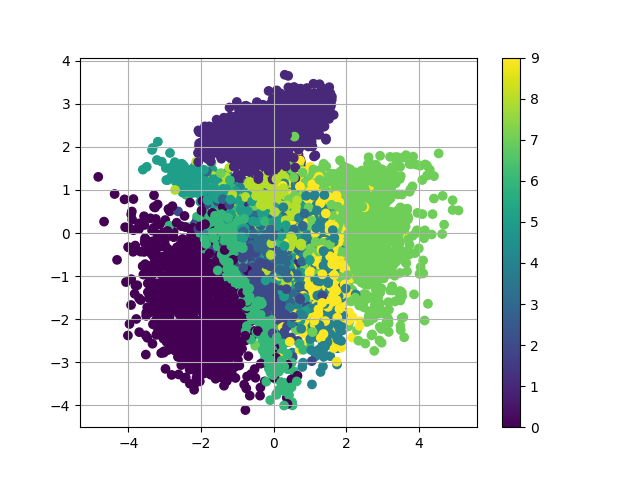

# VAE-tensorflow
this repo aims to implement Variational autoencoder in Tensorflow. To increase the speed of data flow, I use tf.FIFOQueue to speed up the training processs.   
this repo can be a kick off project for you to dive into VAE for other domains!

## dependencies
- python2
- tensorflow (>0.12)
- cuda (>8.0)
- other requirements
```
pip install --user -r requirements.txt
```

## usage
Available options include:
```
-- lr           (default 3e-4, initial learning rate)
-- batch_size   (default 128, batch_size)
-- z_dims 	(default 20, the dimenstion of latent space)
-- task		(default train, choices=[train, eval])
```
To run the model:
```python
python main.py [args]
```

## visualization 

### training process

use tensorboard to visualize the reconstruction   
```
cd logs
tensorboard --logdir .
```

note: click to images on the top, you can see the visualization of the images

### latent space


```
python main.py --task eval --z_dims 2
```

the result may look like:   
   
 
note: the visualization on the top is train with z_dims=2

## reference
[Variational Autoencoder in TensorFlow](https://jmetzen.github.io/2015-11-27/vae.html)


